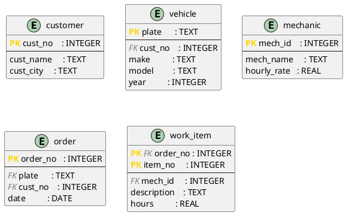

# DBMS_04 – Normalization in Practice: From Plain Text to DDL

**Module:** Databases · THGA Bochum  
**Lecturer:** Stephan Bökelmann · <sboekelmann@ep1.rub.de>  
**Repository:** <https://github.com/MaxClerkwell/DBMS_04>  
**Prerequisites:** DBMS_01, DBMS_02, DBMS_03, Lecture 04 (Normalization)  
**Duration:** 90 minutes

---

## Learning Objectives

After completing this exercise you will be able to:

- Translate a natural-language problem description into a **flat starting table**
- Systematically identify and write down **functional dependencies**
- Decompose the table step by step into **2NF** and **3NF**, verifying losslessness at each step
- Represent the normalized schema as a **PlantUML diagram**
- Implement the schema as **DDL** in SQLite and populate it with sample data
- Formulate three practical **SQL queries** that directly reflect relational algebra

**After completing this exercise you should be able to answer the following questions independently:**

- How do I recognize a partial or transitive dependency in a real table?
- Why is a decomposition only correct if it is lossless?
- When is 3NF sufficient — and when do I need BCNF?

---

## Check Prerequisites

```bash
sqlite3 --version
plantuml -version
git --version
```

> You should see three version strings — SQLite 3.x, PlantUML 1.x, and Git 2.x.
> If a tool is missing, install it:
>
> ```bash
> sudo apt-get install -y sqlite3 plantuml   # Debian / Ubuntu
> brew install sqlite3 plantuml              # macOS
> ```

> **Screenshot 1:** Take a screenshot of your terminal showing all three
> successful version checks and insert it here.
>
> `[insert screenshot]`
> 


---

## 0 – Fork and Clone the Repository

**Step 1 – Fork on GitHub:**  
Navigate to <https://github.com/MaxClerkwell/DBMS_04> and click **Fork**.
Keep the default settings and confirm.

**Step 2 – Clone your fork:**

```bash
git clone git@github.com:<your-username>/DBMS_04.git
cd DBMS_04
ls
```

> You should see only the `README.md`. You will create all further files
> yourself during this exercise.

---

## 1 – The Starting Point: A Workshop and Its Spreadsheet

A small car repair workshop has been managing its repair orders in a single
Excel spreadsheet for years. Each row describes one **work item** within an
order — a single task assigned to a mechanic. The table looks like this
(simplified):

| OrderNo | Date       | CustNo | CustName        | CustCity | Plate       | Make | Model | Year | MechId | MechName   | HourlyRate | ItemNo | Description         | Hours |
|---------|------------|--------|-----------------|----------|-------------|------|-------|------|--------|------------|------------|--------|---------------------|-------|
| 1001    | 2026-03-10 | K01    | Berger, Franz   | Bochum   | BO-AB 123   | VW   | Golf  | 2018 | M03    | Huber, Tom | 65.00      | 1      | Oil change          | 0.5   |
| 1001    | 2026-03-10 | K01    | Berger, Franz   | Bochum   | BO-AB 123   | VW   | Golf  | 2018 | M03    | Huber, Tom | 65.00      | 2      | Replace air filter  | 0.3   |
| 1002    | 2026-03-11 | K02    | Novak, Jana     | Herne    | HER-XY 44   | Ford | Focus | 2020 | M01    | Schulz, P. | 60.00      | 1      | Front brake pads    | 1.5   |
| 1003    | 2026-03-12 | K01    | Berger, Franz   | Bochum   | BO-CD 999   | BMW  | 320i  | 2019 | M03    | Huber, Tom | 65.00      | 1      | Service inspection  | 2.0   |
| 1003    | 2026-03-12 | K01    | Berger, Franz   | Bochum   | BO-CD 999   | BMW  | 320i  | 2019 | M01    | Schulz, P. | 60.00      | 2      | Tyre change         | 0.8   |

The primary key of this flat table is `(OrderNo, ItemNo)` — every combination
of order number and item number appears exactly once.

### Task 1a – Identify Anomalies

Read the table carefully and describe one concrete example of each:

1. **Update anomaly:** Which rows would need to be changed simultaneously if
   mechanic Huber raises his hourly rate to 70.00?
2. **Insert anomaly:** Can a new mechanic be added before they work on their
   first order? What is missing?
3. **Delete anomaly:** What information is permanently lost if order 1002 is
   deleted entirely?

> *Your answers:*
> - If the mechanic Tom Huber raises his hourly rate from 65.00 to 70.00, all three relevant records—lines 1, 2, and 4 (where MechId = M03 and MechName = Huber, Tom)—must be updated at the same time. If even one of these entries is missed, the database becomes inconsistent: two records would show a rate of 70.00, while another would still display 65.00. In that case, it would no longer be clear which rate is actually correct.
> - A new mechanic, for example M05 / Klein, Hans / 58.00, cannot be entered into the database until they are assigned to a repair order, because the table requires additional information such as OrderNo, Date, CustNo, Plate, ItemNo, and so on. Since this data is not yet available, the mechanic cannot be recorded. As a result, the mere existence of a mechanic cannot be stored independently of an active repair order.
> - If order 1002 is deleted entirely, the only record that contains information about customer K02 (Novak, Jana from Herne) and the vehicle HER-XY 44 (Ford Focus, 2020) is also removed. As a result, all of this information is permanently lost: it is no longer possible to identify who Jana Novak is, nor to determine that the vehicle HER-XY 44 belongs to her or that it is a Ford Focus.

### Task 1b – Write Down Functional Dependencies

List all non-trivial functional dependencies you can identify in the flat table.
Use the notation $X \rightarrow Y$.

Hints:
- Which attributes uniquely determine the customer?
- Which attributes follow from the licence plate alone?
- What does a single mechanic ID determine?
- What only follows from the combination `(OrderNo, ItemNo)`?

> *Your FD list:*
>
> - CustNo → CustName, CustCity   CustNo uniquely determines the customer’s details: each customer number corresponds to exactly one customer, including their name and city.
>
> - Plate → Make, Model, Year, CustNo   Plate uniquely identifies a vehicle: each license plate corresponds to exactly one set of details(make, model, year ),as well as the associated customer (owner).
>
> - MechId → MechName, HourlyRate  MechId uniquely determines the mechanic’s details: each mechanic ID corresponds to exactly one mechanic, including their name and hourly rate.
>
> - {OrderNo, ItemNo} → MechId, Description, Hours  The combination of OrderNo and ItemNo uniquely determines the details of a specific task: it specifies which mechanic performed the work, what was done, and how many hours were spent.

### Questions for Task 1

**Question 1.1:** Is `CustNo → CustCity` a *full* or *partial* dependency with
respect to the primary key `(OrderNo, ItemNo)`? Justify your answer using the
definition from Lecture 04.

> *Your answer:*
>
> Partial dependency.
>The primary key is {OrderNo, ItemNo}. The functional dependency CustNo → CustCity is determined solely by CustNo, and CustNo itself depends only on OrderNo, which is a proper subset of the composite key.
Formally: CustNo is a strict subset of {OrderNo, ItemNo}, and the dependency CustNo → CustCity holds.
According to the definition of Second Normal Form (2NF), CustCity is therefore partially dependent on the primary key, and the relation violates 2NF.

**Question 1.2:** Identify a transitive dependency in the flat table and explain
why it violates 3NF.

> *Your answer:*
>
> Example: OrderNo → CustNo → CustCity
>1- OrderNo → CustNo: each order is assigned to exactly one customer.
>2- CustNo → CustCity: each customer is associated with exactly one city.
>3- Therefore, by transitivity, OrderNo → CustCity.
> 
>This violates Third Normal Form (3NF) because:
>1- CustNo is not a superkey of the relation, and
>2- CustCity is not a key attribute (it is not part of any candidate key).
As a result, CustCity (and CustName) are transitively dependent on the primary key through CustNo.

**Question 1.3:** Compute the attribute closure $\{\mathrm{OrderNo}\}^+$ using
your FD list. Is `OrderNo` alone a superkey of the flat table?

> *Your answer:*
>
> {OrderNo}+ = {OrderNo, Date, Plate, CustNo, CustName, CustCity, Make, Model, Year}
Is OrderNo a superkey? No. Its closure does not include attributes such as ItemNo, MechId, Description, or Hours. Since one order can contain multiple work items, the combination (OrderNo, ItemNo) is necessary to uniquely identify a tuple.

---

## 2 – Normalization

### Task 2a – Decompose into 2NF

All attributes that depend only partially on the primary key `(OrderNo, ItemNo)`
must be moved into separate relations. Work out the decomposition on paper first,
then fill in the table below.

**Result (fill in):**

| Relation       | Attributes                                         | Primary Key            |
|----------------|----------------------------------------------------|------------------------|
| `customer`     | `cust_no`, `cust_name`, `cust_city`               | `cust_no`              |
| `vehicle`      | `plate`, `make`, `model`, `year`, `cust_no`       | `plate`                |
| `mechanic`     | `mech_id`, `mech_name`, `hourly_rate`             | `mech_id`              |
| `order`        | `order_no`, `date`, `plate`, `cust_no`            | `order_no`             |
| `work_item`    | `order_no`, `item_no`, `mech_id`, `description`, `hours` | `(order_no, item_no)` |

Check: In every relation, does each non-key attribute depend on the **complete**
primary key?

> *Your check:*
>
> customer: simple key `cust_no`. `cust_name` and `cust_city` are entirely dependent on `cust_no`.
vehicle: simple key `plate`. `make`, `model`, `year`, and `cust_no` are entirely determined by the plate.
mechanic: simple key `mech_id`. `mech_name` and `hourly_rate` are entirely dependent on `mech_id`.
order: simple key `order_no`. `date`, `plate`, and `cust_no` are all dependent on `order_no`.
work_item: composite key (`order_no`, `item_no`). `mech_id`, `description`, and `hours` cannot be determined without both attributes together; a single order can have multiple items.
All relationships are 2NF.

### Task 2b – Decompose into 3NF

Examine `order` and `vehicle` for transitive dependencies.

- In `order`: does `cust_no` depend directly on `order_no`? Does `cust_name`
  transitively depend on it through `cust_no`? *(After the 2NF split,
  `cust_name` should already be in `customer` — verify that this is correct.)*
- In `vehicle`: is there a dependency between `plate` and `cust_no` that
  requires a further split, or is `vehicle` already in 3NF?

State your conclusion: are all five relations from Task 2a already in 3NF?
If not, perform the missing decomposition.

> *Your analysis and any further decomposition:*
>
> In `order`: The only non-trivial dependency relationship is `order_no` → `date`, `plate`, `cust_no`.
None of the dependencies between `date`, `plate`, and `cust_no` exist. `cust_name` and `cust_city` have already been extracted to `customer`. `order` is already in 3NF.
In `vehicle`: The dependency relationship `plate` → `cust_no` is valid. Is this a transitive dependency? No, `cust_no` is a foreign key directly determined by the primary key `plate`. There is no chain `plate → X → something` where X is not a superkey. `vehicle` is already in 3NF.
Conclusion: The five relationships resulting from the 2NF decomposition are all in 3NF.
No further decomposition is necessary.

### Task 2c – Verify Losslessness

Pick one of the decompositions you performed (e.g. the split of the original
table into `order` and `vehicle`) and verify it using the **Heath criterion**:

$$R_1 \cap R_2 \rightarrow R_1 \setminus R_2 \quad \text{or} \quad R_1 \cap R_2 \rightarrow R_2 \setminus R_1$$

Name the shared attributes, state the FD you rely on, and conclude whether the
decomposition is lossless.

> *Your verification:*
>
> Decomposition: order(order_no, date, plate, cust_no) and vehicle(plate, make, model, year, cust_no)
Shared attributes: R1∩R2={plate,cust_no}
FD relied on:
plate→make,model,year
Heath check:
(R1∩R2)→(R2∖R1):{plate,cust_no}→{make,model,year} 
Conclusion: The shared attributes contain plate, which is the primary key of vehicle. Heath's criterion is satisfied → the decomposition is lossless.

### Questions for Task 2

**Question 2.1:** Why must `cust_no` remain as a foreign key in `order` even
though the customer is also reachable via the vehicle's licence plate?
Describe a realistic scenario where the direct link `order → customer` is
necessary.

> *Your answer:*
>
> Scenario: A customer brings in a vehicle that doesn't belong to them (borrowed from a friend, company car). In this case, `vehicle.cust_no` points to the owner of the vehicle, but the customer who brought in the car and is responsible for paying the bill (`order.cust_no`) is a different person.
Without the direct link `order → customer`, it would be impossible to determine who owes the bill without joining `vehicle`, and this join would return the wrong person. The direct link is therefore semantically justified and does not violate 3NF: `cust_no` in `order` depends directly on the `order_no` key, not transitively via `plate`.

**Question 2.2:** Is the schema after the 3NF decomposition also in BCNF?
Justify your answer using the definition: for every non-trivial FD $X \rightarrow Y$,
$X$ must be a superkey.

> *Your answer:*
>
> customer(cust_no, cust_name, cust_city)
The only non-trivial FD is cust_no → cust_name, cust_city. Since cust_no is the primary key, it is a superkey.
mechanic(mech_id, mech_name, hourly_rate)
The FD is mech_id → mech_name, hourly_rate. The determinant is the primary key.
vehicle(plate, cust_no, make, model, year)
The only FD is plate → cust_no, make, model, year. No other meaningful FDs exist (e.g. make → model or (make, model) → year do not hold).
order(order_no, date, plate, cust_no)
The FD is order_no → date, plate, cust_no. Although plate → cust_no exists via vehicle, it is not treated as a separate FD here. The primary key remains the determinant.
work_item(order_no, item_no, mech_id, description, hours)
The FD is (order_no, item_no) → mech_id, description, hours. No smaller determinant applies (e.g. order_no → mech_id or item_no → description do not hold).

**Question 2.3:** The hourly rate of a mechanic is stored in `mechanic`. If a
mechanic changes their rate during the year, what problem arises for already
completed orders? How could the schema be extended to correctly record
historical hourly rates?

> *Your answer:*
>
> Problem: If Huber increases his hourly rate mid-year, existing orders still remain in work_item with their mech_id. However, the hourly_rate stored in mechanic is updated to the new value. As a result, invoices calculated retrospectively may become incorrect.
>
> Schema extension solution:
Create a historical rate table:

</> SQL
CREATE TABLE mechanic_ rate (
mech_id INTEGER NOT NULL ,
valid_from DATE NOT NULL ,
hourly_rate REAL NOT NULL CHECK ( hourly_rate > 0) ,
PRIMARY KEY ( mech_id , valid_from ) ,
FOREIGN KEY ( mech_id ) REFERENCES mechanic ( mech_id )
ON DELETE RESTRICT ON UPDATE CASCADE
) ;

> To find the applicable rate for a given order, we combine `work_item` with `mechanic_rate`, searching for the row where `valid_from` is the largest date less than or equal to the order date. The current rate in `mechanic_rate` can then be deleted or kept as the default value.

---

## 3 – Schema Diagram

### Task 3a – Create the PlantUML File

Create `schema.puml` in the repository directory:

```bash
vim schema.puml
```

> If you have never used Vim, run `vimtutor` in your terminal first — a
> self-contained 30-minute interactive lesson. The essential commands:
> - `i` — enter Insert mode (you can type)
> - `Esc` — return to Normal mode
> - `:w` — save the file
> - `:wq` — save and quit
> - `:q!` — quit without saving

Transfer your normalized schema into PlantUML IE notation. Use the following
skeleton and add the missing attributes and relationships according to your
result from Task 2:



Add the missing relationship lines. Every foreign key relationship needs one
line. PlantUML IE multiplicity notation:

| Notation | Meaning |
|----------|---------|
| `\|\|` | exactly one |
| `o{` | zero or many |
| `\|{` | one or many |
| `o\|` | zero or one |

### Task 3b – Render and Review

```bash
plantuml -tsvg schema.puml
```

Open `schema.svg` in a browser and check:
- Are all five entities visible?
- Does every foreign key relationship show the correct multiplicity?
- Are PK and FK correctly marked?

If you are working on the student server, copy the file to your local machine first:

```bash
scp <username>@<server>:/path/to/DBMS_04/schema.svg ~/Downloads/schema.svg
```

> **Screenshot 2:** Take a screenshot showing the rendered diagram with all
> five entities and their relationships.
>
> `[insert screenshot]`
>


### Task 3c – Commit

```bash
git add schema.puml
echo "schema.svg" >> .gitignore
echo "*.db"       >> .gitignore
git add .gitignore
git commit -m "docs: normalized schema diagram for workshop management"
```

---

## 4 – DDL: Implement the Schema in SQLite

### Task 4a – Write schema.sql

```bash
vim schema.sql
```

Write `CREATE TABLE` statements for all five relations. Requirements:

- Every table must have an explicit `PRIMARY KEY` constraint.
- Every foreign key must be declared with `ON DELETE` and `ON UPDATE` actions —
  choose the most restrictive action that is still domain-correct.
- `work_item.hours` must be greater than zero: `CHECK (hours > 0)`.
- `mechanic.hourly_rate` must also be greater than zero.
- Use SQLite types only (`INTEGER`, `TEXT`, `REAL`, `DATE`).

<details>
<summary>Solution skeleton — try it yourself first</summary>

```sql
PRAGMA foreign_keys = ON;

CREATE TABLE customer (
    cust_no   INTEGER PRIMARY KEY,
    cust_name TEXT    NOT NULL,
    cust_city TEXT    NOT NULL
);

CREATE TABLE vehicle (
    plate    TEXT    PRIMARY KEY,
    cust_no  INTEGER NOT NULL,
    make     TEXT    NOT NULL,
    model    TEXT    NOT NULL,
    year     INTEGER NOT NULL,
    FOREIGN KEY (cust_no) REFERENCES customer(cust_no)
        ON DELETE RESTRICT ON UPDATE CASCADE
);

CREATE TABLE mechanic (
    mech_id     INTEGER PRIMARY KEY,
    mech_name   TEXT    NOT NULL,
    hourly_rate REAL    NOT NULL CHECK (hourly_rate > 0)
);

CREATE TABLE "order" (
    order_no INTEGER PRIMARY KEY,
    plate    TEXT    NOT NULL,
    cust_no  INTEGER NOT NULL,
    date     DATE    NOT NULL,
    FOREIGN KEY (plate)   REFERENCES vehicle(plate)
        ON DELETE RESTRICT ON UPDATE CASCADE,
    FOREIGN KEY (cust_no) REFERENCES customer(cust_no)
        ON DELETE RESTRICT ON UPDATE CASCADE
);

CREATE TABLE work_item (
    order_no    INTEGER NOT NULL,
    item_no     INTEGER NOT NULL,
    mech_id     INTEGER NOT NULL,
    description TEXT    NOT NULL,
    hours       REAL    NOT NULL CHECK (hours > 0),
    PRIMARY KEY (order_no, item_no),
    FOREIGN KEY (order_no) REFERENCES "order"(order_no)
        ON DELETE CASCADE ON UPDATE CASCADE,
    FOREIGN KEY (mech_id)  REFERENCES mechanic(mech_id)
        ON DELETE RESTRICT ON UPDATE CASCADE
);
```

> Note: `order` is a reserved word in SQL. It must be quoted with double quotes
> in SQLite, or you rename the table to `repair_order` to avoid the conflict
> entirely — which is often the cleaner choice in practice.

</details>

### Task 4b – Load the Schema and Verify

```bash
sqlite3 workshop.db < schema.sql
sqlite3 workshop.db ".tables"
```

> You should see: `customer  mechanic  order  vehicle  work_item`

> **Screenshot 3:** Take a screenshot showing the `.tables` output.
>
> `[insert screenshot]`
> 


### Task 4c – Insert Sample Data

```bash
vim data.sql
```

Insert the data from the flat table in Section 1, now split across the five
normalized relations. Start with the tables that have no foreign keys
(`customer`, `mechanic`), then `vehicle`, then `order`, and finally `work_item`.

<details>
<summary>Sample data — try it yourself first</summary>

```sql
PRAGMA foreign_keys = ON;

-- Customers
INSERT INTO customer VALUES (1, 'Berger, Franz', 'Bochum');
INSERT INTO customer VALUES (2, 'Novak, Jana',   'Herne');

-- Mechanics
INSERT INTO mechanic VALUES (1, 'Schulz, P.', 60.00);
INSERT INTO mechanic VALUES (3, 'Huber, Tom', 65.00);

-- Vehicles
INSERT INTO vehicle VALUES ('BO-AB 123', 1, 'VW',   'Golf',  2018);
INSERT INTO vehicle VALUES ('HER-XY 44', 2, 'Ford', 'Focus', 2020);
INSERT INTO vehicle VALUES ('BO-CD 999', 1, 'BMW',  '320i',  2019);

-- Orders
INSERT INTO "order" VALUES (1001, 'BO-AB 123', 1, '2026-03-10');
INSERT INTO "order" VALUES (1002, 'HER-XY 44', 2, '2026-03-11');
INSERT INTO "order" VALUES (1003, 'BO-CD 999', 1, '2026-03-12');

-- Work items
INSERT INTO work_item VALUES (1001, 1, 3, 'Oil change',         0.5);
INSERT INTO work_item VALUES (1001, 2, 3, 'Replace air filter', 0.3);
INSERT INTO work_item VALUES (1002, 1, 1, 'Front brake pads',   1.5);
INSERT INTO work_item VALUES (1003, 1, 3, 'Service inspection', 2.0);
INSERT INTO work_item VALUES (1003, 2, 1, 'Tyre change',        0.8);
```

</details>

```bash
sqlite3 workshop.db < data.sql
```

Verify the row counts:

```sql
SELECT 'customer',  COUNT(*) FROM customer
UNION ALL SELECT 'mechanic',  COUNT(*) FROM mechanic
UNION ALL SELECT 'vehicle',   COUNT(*) FROM vehicle
UNION ALL SELECT 'order',     COUNT(*) FROM "order"
UNION ALL SELECT 'work_item', COUNT(*) FROM work_item;
```

> Expected: 2, 2, 3, 3, 5.

Commit:

```bash
git add schema.sql data.sql
git commit -m "feat: DDL and sample data for normalized workshop schema"
```

### Questions for Task 4

**Question 4.1:** `ON DELETE CASCADE` was chosen for the foreign key
`work_item.order_no`, but `ON DELETE RESTRICT` for `vehicle.cust_no`.
Justify both choices in terms of the domain — what does it mean for the
business if an order is deleted versus if a customer is deleted?

> *Your answer:*
>
> work_item.order_no ON DELETE CASCADE: A work item only has meaning in the context of an order. If an order is deleted (e.g. due to cancellation or correction of an entry), all related work items are automatically removed as well. Keeping such records without a corresponding order would be semantically inconsistent.
vehicle.cust_no ON DELETE RESTRICT: A vehicle may exist independently of an active customer, but it must always have an owner. Deleting a customer who is still linked to a vehicle would result in the loss of ownership information. The RESTRICT option ensures that the vehicle must first be reassigned or handled appropriately before the customer can be deleted, thereby preserving data integrity.

**Question 4.2:** Test referential integrity by running:

```sql
PRAGMA foreign_keys = ON;
INSERT INTO work_item VALUES (9999, 1, 3, 'Ghost item', 1.0);
```

What error do you get? What does this tell you about the difference between
a constraint declared in DDL and one that is actually enforced at runtime?

> *Your answer:*
>
> The order 9999 does not exist in the order table. Therefore, SQLite rejects the insertion and returns the error FOREIGN KEY constraint failed.
This highlights the difference between a declared constraint (the FOREIGN KEY defined in the DDL) and a constraint that is actually enforced at runtime. If PRAGMA foreign_keys = ON is not set, SQLite would accept the insertion without raising an error—the constraint exists syntactically but is not enforced.
This behavior is specific to SQLite: foreign key enforcement is disabled by default and must be explicitly enabled for each session.

**Question 4.3:** Test the CHECK constraint:

```sql
INSERT INTO work_item VALUES (1001, 3, 3, 'Invalid', -0.5);
```

What happens? What would happen if the CHECK constraint were missing?

> *Your answer:*
>
> SQLite rejects the value -0.5 because it violates the constraint CHECK (hours > 0).
Without this constraint, the negative value would be accepted into the database. As a consequence, later calculations (such as total hours or invoice amounts) could become incorrect—for example, negative hours might offset actual working hours. This would lead to silent data corruption, with no error message, only incorrect results.

---

## 5 – SQL Queries

Save all three queries in a file called `queries.sql`. Write a short comment
before each query describing its purpose.

### Task 5a – All Work Items for a Given Customer

**Task:** List all order numbers, order dates, licence plates, item descriptions,
and hours for customer `Berger, Franz`, ordered by date and item number.

Write the relational algebra expression first (in words or formal notation),
then the SQL query.

```sql
-- Query 5a: insert here

-- Query 5 a : All work items for customer ' Berger , Franz '
-- Query 5 a : All work items for customer ' Berger , Franz '
-- Ordered by date and item number
-- Ordered by date and item number
SELECT
o.order_no ,
o.date ,
v.plate ,
wi.description ,
wi.hours
FROM customer c
JOIN " order " o ON o.cust_no = c.cust_no
JOIN vehicle v ON v.plate = o.plate
JOIN work_item wi ON wi.order_no = o.order_no
WHERE c.cust_name = 'Berger , Franz'
ORDER BY o.date , wi.item_no ;
```

<details>
<summary>Expected result</summary>

Four rows: two items from order 1001 (Golf, 2026-03-10) and two items from
order 1003 (BMW 320i, 2026-03-12).

</details>

**Question 5a:** This query joins four tables (`customer`, `order`, `vehicle`,
`work_item`). In what order would the query optimizer ideally perform the joins —
and why does the join order not affect the *result*, but does affect *performance*?

> *Your answer:*
>
> The order of joins does not change the final result because the natural join is commutative and associative (properties of relational algebra).
From a performance perspective, however, the optimizer tries to reduce intermediate result sizes as early as possible. An efficient strategy would be:
1- First apply the condition cust_name = 'Berger, Franz' to the customer table (reducing it from 2 rows to 1).
2- Join this result with order (1 customer → 2 out of 3 orders).
3- Join with work_item (2 orders → 4 out of 5 work items).
4- Finally, join with vehicle to retrieve the license plate.
Creating an index on customer.cust_name would significantly speed up the first step.

---

### Task 5b – Total Hours per Mechanic in March 2026

**Task:** For each mechanic, compute the sum of all hours worked on orders whose
date falls in March 2026. Show `mech_name`, `total_hours` (rounded to one decimal
place), and `orders` (the number of distinct orders in which the mechanic had at
least one work item). Sort descending by `total_hours`.

```sql
-- Query 5b: insert here

-- Query 5 b : Total hours per mechanic for orders in March
2026
SELECT
m.mech_name ,
ROUND ( SUM ( wi.hours ) , 1) AS total_hours ,
COUNT ( DISTINCT wi.order_no ) AS orders
FROM mechanic m
JOIN work_item wi ON wi.mech_id = m.mech_id
JOIN " order " o ON o.order_no = wi.order_no
WHERE o.date LIKE '2026 -03 -%'
GROUP BY m.mech_id , m.mech_name
ORDER BY total_hours DESC ;
```

<details>
<summary>Expected result</summary>

| mech_name  | total_hours | orders |
|------------|-------------|--------|
| Huber, Tom | 2.8         | 2      |
| Schulz, P. | 2.3         | 2      |

</details>

**Question 5b:** Using `COUNT(DISTINCT order_no)` counts orders, not items.
What would `COUNT(*)` count instead, and why would the result differ in this
case?

> *Your answer:*
>
> COUNT(DISTINCT order_no) counts the number of different orders a mechanic has worked on. In this case, Huber worked on order 1001 (2 work items) and order 1003 (1 work item), which results in 2 distinct orders.
In contrast, COUNT(*) counts the total number of rows in work_item, meaning the number of work items (positions) rather than orders. For Huber, this would be 3 (items 1001/1, 1001/2, 1003/1), not 2.
The difference appears whenever a mechanic works on multiple items within the same order, which is exactly the situation here.

---

### Task 5c – Vehicles with No Repair Order

**Task:** Return the licence plate and model of every vehicle for which
**no** order exists in the database.

Use a set-difference approach with `EXCEPT` and also write an alternative using
`NOT EXISTS`.

```sql
-- Variant 1: EXCEPT
-- Query 5c-1: insert here

-- Query 5c -1 : Vehicles with no repair order ( EXCEPT )
SELECT plate , model FROM vehicle
EXCEPT
SELECT v.plate , v.model
FROM vehicle v
JOIN " order " o ON o.plate = v.plate ;

-- Variant 2: NOT EXISTS
-- Query 5c-2: insert here

-- Query 5c -2 : Vehicles with no repair order ( NOT EXISTS )
SELECT v.plate , v.model
FROM vehicle v
WHERE NOT EXISTS (
SELECT 1
FROM " order " o
WHERE o.plate = v.plate
) ;
```

<details>
<summary>Expected result</summary>

With the data from Task 4c there are no matches — all three vehicles have at
least one order. Insert a fourth vehicle without an order to test the query:

```sql
INSERT INTO vehicle VALUES ('BOT-ZZ 1', 1, 'Toyota', 'Yaris', 2022);
```

After that, the query should return `BOT-ZZ 1 | Yaris`.

</details>

**Question 5c:** `EXCEPT` and `NOT EXISTS` are logically equivalent — they
always produce the same result. Are there situations where one approach should
be preferred in practice? Consider readability and extensibility.

> *Your answer:*
>
> The two approaches are logically equivalent as long as no NULL values are involved.
In practice:
EXCEPT is preferable when:
- comparing the results of two separate queries (better readability),
- the problem is naturally expressed as a set difference.
NOT EXISTS is preferable when:
- the correlated subquery must check multiple conditions (e.g. WHERE o.plate = v.plate AND o.date > '2025-01-01'), since it is more flexible and easier to extend.
However, if the left-hand table contains NULL values, EXCEPT may behave differently depending on the DBMS (some treat NULL = NULL in set operations, while standard comparisons do not).
In this case, NOT EXISTS is clearer because it explicitly expresses that no corresponding order exists for a given vehicle, making the query more understandable from a semantic and maintenance perspective.

---

Commit:

```bash
git add queries.sql
git commit -m "feat: three SQL queries on normalized workshop schema"
```

---

## 6 – Reflection

**Question A – Normalization and redundancy:**  
The original flat table had 5 rows and 15 columns. The normalized schema has
5 tables. At which data volume does normalization pay off most — at 5 rows or
at 50,000? Justify with concrete reference to the anomalies from Task 1a.

> *Your answer:*
>
> Normalization becomes more beneficial as the data volume grows.
With only 5 rows, anomalies may exist, but their impact is minimal—manually correcting a few entries is still manageable.
With 50,000 rows, however, the situation changes significantly: Huber, Tom may appear in thousands of work items. Updating the hourly rate would require a large-scale update, with a risk of inconsistency if a transaction fails midway. Inserting a new customer without an associated order is still not possible, and deleting an order could remove important customer information.
In a normalized schema, these issues are avoided: each change is performed only once in the appropriate table (e.g., mechanic or customer). This greatly improves data consistency, robustness, and update efficiency, especially as the dataset grows.

**Question B – 3NF vs. BCNF:**  
Lecture 04 explains that BCNF is not always dependency-preserving. Is this
relevant for the workshop schema? Would a BCNF decomposition have looked
different from the 3NF decomposition here?

> *Your answer:*
>
> For this schema, the decompositions in 3NF and BCNF are identical. Applying BCNF would result in the same five relations.
The distinction between 3NF and BCNF only becomes relevant when a relation contains multiple overlapping candidate keys (as in the Kursraum example discussed in class). In this case, each relation has only one candidate key, or a composite key with only trivial sub-dependencies.
Therefore, there is no issue with dependency preservation, and 3NF is both sufficient and optimal for this schema.

**Question C – Redundant foreign key in `order`:**  
`order` contains both `plate` (FK → `vehicle`) and `cust_no` (FK → `customer`).
Since `vehicle` itself contains `cust_no`, one might argue that `cust_no`
in `order` is redundant and violates 3NF. Is that correct? When would such
a deliberate denormalization be justified?

> *Your answer:*
>
> No, it is neither redundant nor a violation of 3NF.
The attribute cust_no in order depends directly on the primary key order_no (semantics: who placed the order?). It is not a transitive dependency via plate.
If cust_no were derived only from plate (through vehicle.cust_no), then it would indeed be redundant. However, the domain logic justifies storing it separately: the customer placing the order may differ from the registered owner of the vehicle (e.g., loaned cars, company vehicles).
A deliberate denormalization could still be justified for performance reasons (to avoid additional joins on large datasets) or for robustness (ensuring order history remains stable even if vehicle data changes). In such cases, the redundancy should be clearly documented and controlled through triggers or procedures.

**Question D – NULL and order status:**  
An order that has just been created may have no work items yet. What does the
current schema say about this case? Would the schema need to be extended to
correctly represent an order's status (open / completed)? Sketch the necessary
change.

> *Your answer:*
>
> The current schema allows an order to exist without any associated work items. The ON DELETE CASCADE constraint only ensures that work items are deleted when their parent order is deleted; it does not require every order to have at least one work item.
To represent the state of an order, the order table should be extended with a status attribute:
</> SQL
ALTER TABLE "order" ADD COLUMN status TEXT NOT NULL
DEFAULT 'open'
CHECK (status IN ('open', 'in_progress', 'completed', 'cancelled'));
An open order may not yet have any work items. A completed order means that all work items have been recorded and the invoice can be issued. This attribute makes it possible to filter active orders without counting work items and to prevent modifications to closed orders using triggers.

> **Screenshot 4:** Take a screenshot showing the output of Query 5b directly
> in `sqlite3` (with `.headers on` and `.mode column` activated).
>
> `[insert screenshot]`
>
> 


---

## Bonus Tasks

1. **Hourly rate history:** Design a schema extension that allows recording a
   mechanic's hourly rate historically — i.e. which rate applied at the time a
   specific order was processed. Write the modified `CREATE TABLE` statements.

   >SELECT wi.order_no , wi.hours ,
mr.hourly_rate ,
wi.hours * mr.hourly_rate AS amount
FROM work_item wi
JOIN "order" o ON o.order_no = wi.order_no
JOIN mechanic_rate mr ON mr.mech_id = wi.mech_id
AND mr.valid_from = (
SELECT MAX (valid_from) FROM mechanic_rate
WHERE mech_id = wi.mech_id AND valid_from <= o.date ) ;
   >
   >CREATE TABLE mechanic_rate (
mech_id INTEGER NOT NULL ,
valid_from DATE NOT NULL ,
hourly_rate REAL NOT NULL CHECK ( hourly_rate > 0) ,
PRIMARY KEY ( mech_id , valid_from ) ,
FOREIGN KEY ( mech_id ) REFERENCES mechanic ( mech_id )
ON DELETE RESTRICT ON UPDATE CASCADE
) ;

2. **Spare parts:** The workshop also charges for parts in addition to labour.
   Extend the schema with a `part` table and a `order_part` join table that
   records which parts were used in which order. Maintain normal form and
   referential integrity.

   >CREATE TABLE part (
    part_no     INTEGER PRIMARY KEY,
    description TEXT    NOT NULL,
    unit_price  REAL    NOT NULL CHECK (unit_price >= 0)
);

CREATE TABLE work_item_part (
    order_no INTEGER NOT NULL,
    item_no  INTEGER NOT NULL,
    part_no  INTEGER NOT NULL,
    quantity INTEGER NOT NULL CHECK (quantity > 0),
    PRIMARY KEY (order_no, item_no, part_no),
    FOREIGN KEY (order_no, item_no) REFERENCES work_item(order_no, item_no)
        ON DELETE CASCADE ON UPDATE CASCADE,
    FOREIGN KEY (part_no) REFERENCES part(part_no)
        ON DELETE RESTRICT ON UPDATE CASCADE
);

3. **Total invoice per order:** Write a query that computes the total amount for
   each order: the sum of `hours × hourly_rate` across all work items. Which
   tables need to be joined?

   >SELECT
    o.order_no,
    o.date,
    ROUND(
        COALESCE(SUM(wi.hours * m.hourly_rate), 0) +
        COALESCE((
            SELECT SUM(wip.quantity * p.unit_price)
            FROM work_item_part wip
            JOIN part p ON p.part_no = wip.part_no
            WHERE wip.order_no = o.order_no
        ), 0)
    , 2) AS total_amount
FROM "order" o
JOIN work_item wi ON wi.order_no = o.order_no
JOIN mechanic  m  ON m.mech_id   = wi.mech_id
GROUP BY o.order_no, o.date
ORDER BY o.order_no;

4. **GitHub Actions:** Add a workflow file `.github/workflows/release.yml` that
   installs PlantUML, renders `schema.puml` to `schema.svg`, and publishes it
   as a release artifact on every `v*` tag. Trigger a release with
   `git tag v1.0.0 && git push --tags`.

---

## Further Reading

- E. F. Codd (1972): *Further Normalization of the Data Base Relational Model.* In: Rustin (ed.): Data Base Systems.
- [SQLite – CHECK Constraints](https://www.sqlite.org/lang_createtable.html#check_constraints)
- [SQLite – Foreign Key Support](https://www.sqlite.org/foreignkeys.html)
- [PlantUML – Entity Relationship Diagram](https://plantuml.com/ie-diagram)
- Lecture 04 handout – *Normalization*
